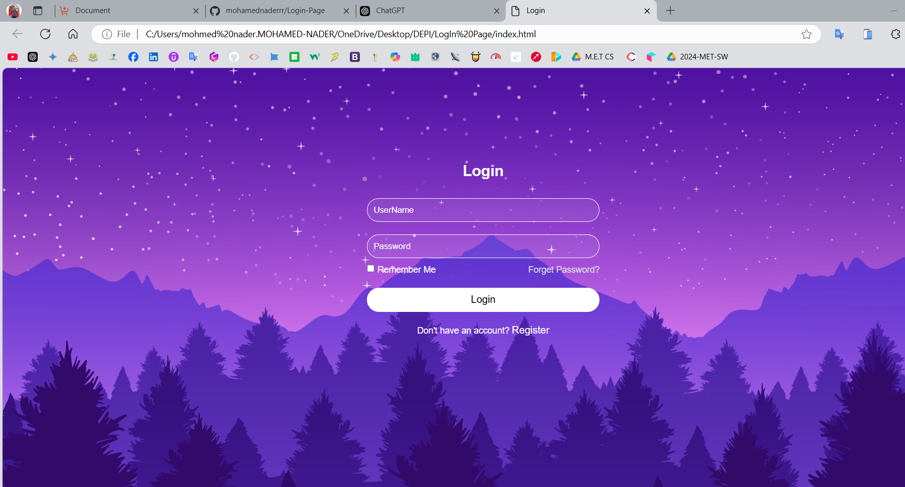

# Login Page

This project is a **simple and responsive login page** with a visually appealing background design. It was built using **HTML** and **CSS**, focusing on both functionality and aesthetics.

## Features
- **User-friendly form** with input fields for:
  - Username
  - Password
- **"Remember Me" checkbox** to enhance user experience.
- **Password recovery link** labeled as "Forget Password?" for users needing assistance.
- **Register link** for new users to create an account.
- **Stylized design** featuring:
  - A serene mountain and forest background with a starry night sky.
  - Clean, modern UI elements with rounded input fields and buttons.

## Technologies Used
- **HTML5** for the structure.
- **CSS3** for styling, including:
  - Gradient effects.
  - Transparent elements.
  - Custom fonts and colors.

  ### Screenshot
  
  

## How to Use
1. Clone this repository:
   ```bash
   git clone [https://github.com/your-username/your-repository.git](https://github.com/mohamednaderrr/Login-Page)

   cd your-repository

   ### Accounts On Social Media
![GitHub]https://github.com/mohamednaderrr.
![Facebook]https://www.facebook.com/profile.php?id=100003506793150.
![LinkedIn]https://www.linkedin.com/in/mohamed-nader-8a1857298/.

